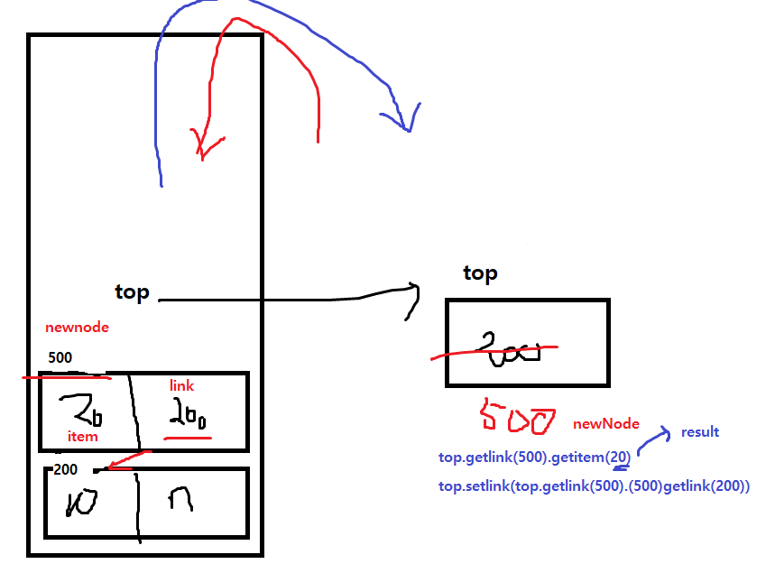

### Static
        public class Count {
        public int X; // 인스턴스 필드
        public static int Y; // 정적필드
        }

---

    public class Main {
        public static void main(String[] args) {
            System.out.println(Count.Y);
            System.out.println(Math.PI);
            // ex) public static final double PI = 3.14159265358979323846;
            // static으로 객체 생성없이 바로 class 불러올 수 있음 (하나로 공유됨!!)
    
            Count c1 = new Count();
            c1.X = 10;
            c1.X++;
    
            c1.Y = 20;
            c1.Y--;
    
            Count c2 = new Count();
    
            c2.X = 100;
            c2.Y = 200;
    
            System.out.printf("c1.x : %d, C1.y : %d\n", c1.X, c1.Y);
            System.out.printf("c2.x : %d, C2.y : %d", c2.X, c2.Y);

            }
    }
- static 은 고정값으로 아무리 객체를 생성해도 객체의 값이 동일하다   
-> Y의 저장공간은 하나!
- C1.Y = C2.Y 값은 계속해서 동일하다  
->굳이 인스턴스(객체화)를 만들 필요가 없어서 그냥 클래스로 접근

---
### 싱글톤패턴

    public class Controller {
    public int number;
    
        //2.
        private static Controller con;
    
        static{
            con = new Controller();
    
        }
    
        //1.
        private Controller(){
        }
    
        // 3.
        public static Controller getInstance(){
            if (con!=null) return con;
            return new Controller();
        }
    }

 1. 단 하나의 생성자에 private 제한을 걸어 외부에서 직접적으로 객체를 생성할 수 없도록 제한
 2. 필드로 객체를 딱 하나 생성시키는데 static제한을 걸어 공유객체로 전환
 3. 준비된 단 하나의 객체를 public메서드를 통해 제공

### 4. 스택과 큐
- 선형자료구조(쌓임)
- 후입선출방식

#### 스택의 연산
- 삽입
항상 스택의 top에서 일어남
- 제거
- 읽기
=> 단방향연결리스트

#### String 연산에 메모리 초과가 많이뜸
String 객체가 += 으로 추가될때마다 계속 객체가 추가됨   
->이거 해결 스트링빌더로 바꾸기
- StringBuilder s = new StringBuilder();
- 문자열 결합효과 : s.append("+\n");
- 저장한걸 통채로 바꾸기 : new StringBuilder("NO") 이렇게 써주기

### 큐(QUEUE)
- 줄서는 의미(대기열/웨이팅)
- 선입선출?
- 감시 노드 2개(front/rear)
