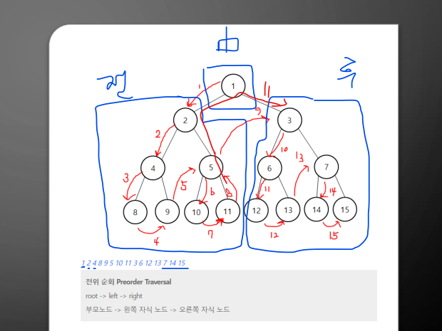

### 07. GROUP BY, HAVING

집계 함수 (다중행 함수) : 여러행을 묶어서 함수를 적용

    SELECT * FROM tb_sal_his
    -- 그룹화 전처리
    WHERE pay_de BETWEEN '20190101' and '20191231'
    ORDER by emp_no, pay_DE
    ;

    SELECT * FROM tb_sal_his
    WHERE emp_no  = '1000000005'
    ;
    
    -- 단일행 함수 : 모두에게 하나씩 적용함 => from의 행수만큼 적용 + 출력됨
    -- 단일열???
    SELECT
    SUBSTR(emp_nm,1,1) 성씨
    FROM tb_emp
    ;
    
    -- 다중행 함수 - 다중열?
    --GROUP BY로 소그룹화 하지 않으면 집계함수는 전체 행수를 기준으로 집계한다.
    SELECT
    SUM(pay_amt) "지급총액"
    , AVG(pay_amt) "평균 지급액"
    , count(pay_amt) "지급 횟수"
    FROM tb_sal_his
    ;

    SELECT * FROM tb_emp
    ;

    SELECT
    COUNT(emp_no) as "총사원수"
    , COUNT(direct_manager_emp_no) AS "상사번호"
    , COUNT(*) as 전부
    -- count 함수는 컬럼이나 표현식에서 null이 나오면 집계를 하지않음
    -- COUNT(*)는 select from해서 나오는 모든 표현식을 다 셈(null도 센당)
    , MIN(birth_de) "최연장자의 생일"
    , MIN(birth_de) "최연소자의 생일"
    FROM tb_emp
    ;

    --GROUO BY : 지정된 컬럼으로 소그룹화 한 후 집계함수 적용
    -- 부서별로 가장 어린사람의 생일, 연장자의 생일 부서별 총 사원수를 조회

    SELECT * FROM tb_emp
    ORDER BY dept_cd
    ;

    SELECT
    -- gropby에서 사용한 컬럼음 바로 사용할 수 있다
    dept_cd,
    MAX(birth_de) as 최연소자
    , MIN (birth_de) as 최연장자
    ,count(emp_no)
    FROM tb_emp
    GROUP BY dept_cd
    ;

    -- 사원별 누적 급여수령액 조회
    SELECT
    emp_no "사번"
    , SUM(pay_amt) 누적수령액
    FROM tb_sal_his
    -- 웨어랑 오더 전에 그룹바이
    GROUP By emp_no
    ORDER BY emp_no
    ;

    -- 사원별로 급여를 제일 많이 받았을때, 제일 적게받았을때, 평균적으로 얼마 받았는지 조회
    SELECT
    emp_no "사번"
    , TO_CHAR(MAX(pay_amt), 'L999,999,999') 최저수령액
    , TO_CHAR(MIN(pay_amt), 'L999,999,999') 최저수령액
    , TO_CHAR(ROUND(AVG(pay_amt),2), 'L999,999,999.99') 평균수령액
    -- , ROUND((pay_amt),2) 통계를 낸 후(집계가 끝난) 조회하는건 가능
    FROM tb_sal_his
    GROUP By emp_no
    ORDER BY emp_no
    ;

    -- 사원별로 2019년 급여를 제일 많이 받았을때, 제일 적게받았을때, 평균적으로 얼마 받았는지 조회
    SELECT
    emp_no "사번"
    , TO_CHAR(MAX(pay_amt), 'L999,999,999') 최저수령액
    , TO_CHAR(MIN(pay_amt), 'L999,999,999') 최저수령액
    , TO_CHAR(ROUND(AVG(pay_amt),2), 'L999,999,999.99') 평균수령액
    , TO_CHAR(SUM(pay_amt), 'L999,999,999') 연봉
    -- , ROUND((pay_amt),2) 통계를 낸 후(집계가 끝난) 조회하는건 가능
    FROM tb_sal_his
    where pay_de BETWEEN '20190101' AND '20191231'
    GROUP By emp_no
    ORDER BY emp_no
    ;

### 자료구조와 알고리즘 10.트리
* 트리 관련 용어
- 경로(path): 어떤 한 노드에서 다른 노드까지 링크를 통해 이동했을 때, 거쳐온 일련의 노드의 집합을 경로라 한다.
    -> ex) 지하철
- 루트(root) : 트리의 가장 상위에 있는 노드, 루트는 *언제나 하나만 존재*해야 한다.
- 부모, 자식 : 링크로 연결되어 있는 노드 중 위에 있는 노드를 부모 노드, 아래에 있는 노드를 자식 노드라 한다.
- 잎(leaf) : *자식을 가지고 있지 않은 노드*를 잎 노드라 한다. 단말노드라고도 부름.
- 키(key) : 키란 자료 항목을 찾거나 다른 동작을 하기 위해 필요한 값으로, 각 자료 항목들을 구분해주는 역할을 하는 값이다.
- 하위트리(subtree): 하나의 큰 트리에 속해 있는 부분을 하위 트리라고 한다.
- 방문(visiting) : 노드에 도착해 자료 값을 읽는 것.
- 순회(traversing) : _트리 노드 전체를 방문하는 것_ 트리 개념의 시작??
- 레벨(level) : 루트를 0레벨이라 하면 그 자식은 1레벨, 그의 자식은 2레벨이라 함.

#### 순회의 종류

1. 전위순회 - 중'전'후

    1. 중앙노드값 출력
        - 1-> 2 -> 4 -> 9 -> 5 -> 10
    2. 왼쪽자식으로 재귀호출해서 반복
    3. 오른쪽 자식쪽으로 재귀호출반복
       - 더이상자식이 없을때까지
2. 중위순회 - 전'중'후  

3. 후위순회 - 전'후'중

