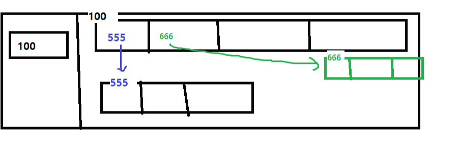

## 배열
1. 배열이란?   
   배열이란 한 개의 변수로 여러 개의 데이터를 저장하고 참조하고 싶을 때 사용

2. 배열의 특징
- 실제 배열 변수에는 배열의 위치 저장되어 있다

- 배열의 길이 = n - 1
    1. homogeneous - 배열은 동종모음구조입니다. 따라서 같은 데이터 형태만 저장할 수 있습니다. *int배열은 int들만 String배열은 String만 저장*시킬 수 있습니다.
    2. immutable - _한번 생성된 배열은 크기(길이)를 늘이거나 줄일 수 없습니다._ 만약 5개를 저장할 배열을 생성했다면 프로그램 실행중에 7개로 늘이거나 2개로 줄일 수 없고 새로운 배열을 생성하여 값을 복사시켜서 이동해야 합니다.
    3. reference type - 배열은 참조타입이며 따라서 변수에 실제 값이 아닌 *데이터객체의 주소값을 저장*합니다.

<br>

## stack | heap

### **stack**
- 좁은공간 <- 변수저장
- 변수찾기는 쉬움
- but 변수 저장의 한도(1개)가 있음 => 저장영역의 한계 (스텍이좁아서)
- 배열변수의 크기는 8byte(=window64bit)

### **heap**
- 배열이 객체 동적 할당
- 찾기쉽게 번호도 붙여줌
- 한 번 할당된 공간을 늘릴 수 없어 값을 수정할 시 새배열로 교체

<br>

### 배열 생성
- 값 목록 나열 (입력은 불가)   
  int[] number = new int[배열의 길이] {10, 20, 30, 40};
- 두번째 선언 부터는 new String[] 생략불가   
  foods = new String[] {"짜장면", "탕수육", "짬뽕"};   
### **배열 생성 후 초기화하지 않는다면**
- 해당타입의 초기값으로 자동 초기화 됨 (3강 4p)

### 배열 내부값 출력 함수
System.out.println(Arrays.toString(배열명));

<br>

### push/pop/delete

| 용어      | 설명               |
|---------|------------------|
| push    | 데이터 삽입           |
| pop     | 맨 끝 데이터 삭제       |
| delete  | 배열 특정 인덱스 데이터 삭제 |
| isEmpty | 배열 안에 존재여부 확인    |


### 2. 배열 복사 알고리즘

    public class ArrayCopy__ {
    
        public static void JavaStudyDate.day07op.PhoneFactory.main(String[] args) {
    
            //**배열복사알고리즘**
            String[] pets = {"멍멍이", "짹짹이", "삐약이"};
    
            // 1. 원본배열과 사이즈가 같은 새 배열을 하나 더 생성 (방하나새로파기)
            String[] petsCopy = new String[pets.length];
            
            // 2. 원본배열에 저장된 값들을 하나하나씩 사본배열로 복사 (옮기기)
    
            // 단) fori + enter = 함수
            for (int i = 0; i < pets.length; i++) {
                petsCopy[i] = pets[i];
            }
    
            pets[1] = "야옹이";
            petsCopy[0] = "어흥이";
    
            System.out.println("원본배열주소 : " + pets);
            System.out.println("원본배열주소 : " + petsCopy);
    
            System.out.println("원본배열 : " + Arrays.toString(pets));
            System.out.println("사본배열 : " + Arrays.toString(petsCopy));
        }
    }

### 3. 배열 추가 알고리즘

    public class ArrayPop {
    public static void JavaStudyDate.day07op.PhoneFactory.main(String[] args) {
    
            //배열의 맨 끝 데이터 삭제
            int[] arr = {10,20,30,40};
    
            // 1. 기존 배열보다 크기가 1 작은 새 배열 생성(임시)
            int[] temp = new int[arr.length - 1];
    
            // 2. 맨 끝 데이터를 제외한 나머지 데이터를 복사 - 기존배열-1
            for (int i = 0; i < arr.length-1; i++) {
                temp[i] = arr[i];
            }
            // 3. 주소 바꿔주기
            arr = temp;
            temp = null;
            System.out.println("삭제 후: " + Arrays.toString(temp));
    
            // indexof(탐색) -> 중간삭제 / 삭제/ 추가
        }
    }


### 4. 배열 탐색 알고리즘

    public class ArraySearch {
    public static void JavaStudyDate.day07op.PhoneFactory.main(String[] args) {
    //배열탐색 알고리즘 : 인덱스 찾기, 유무 확인
    
            // 순차탐색
            // 배열만들기
            String[] foods = {"치킨", "피자", "삼겹살", "파스타"};
            String target = "치킨"; //유무및 인덱스 위치확인
            
            int index = -1; // 찾은인덱스 저장할변수 - 유무확인에서 사용
            // index에서 ++ 해주면서 비교해줌
            for (int i = 0; i < foods.length ; i++) {
                // 찾은 인덱스와 비교 반복적
                if(target.equals(foods[i])) {
                    index = i;
                    break;
                }
            } //end for
            System.out.println("찾은 인덱스 : " + index);
    
            //유무확인
            boolean hasFood = index != -1; //! + =
            System.out.println("존재유무 : " + hasFood);
    
            // 수정을 하려면 인덱스 알아야함 -> 탐색
            foods[2] = "보쌈";
        }
    }

### 5. 역정렬

    public class ArrayReverse {
    
        public static void JavaStudyDate.day07op.PhoneFactory.main(String[] args) {
            // 역정렬 : 끝에 두개씩 자리 바꾸기 - 과정은 아래에
            int [] arr = {1, 3, 5, 7, 9, 11, 13, 15, 17, 21};
            System.out.println("reverse before : " + Arrays.toString(arr));
    
    
            for (int i = 0; i < arr.length /2; i++) {
                int temp = arr[i];
                arr[i] = arr[arr.length-1-i];
                arr[arr.length-1-i] = temp;
            }
    
            System.out.println("reverse after : " + Arrays.toString(arr));
        }
    }


### 6. 배열의 중간삭제
[1, 3, 5, 7, 9, 11] - 3 삭제 / length 6      
[1, 5, 7, 9, 11] - length 5 / 5개 배열로 바꾸기X   
5값 복사 - 3위치에 플러스    
값을 앞으로 다 땡김 -> 마지막 삭제   


#### 오늘의 ???
- 계속해서 데이터를 입력을 받아야한다면 while문 안에 입력하는 것을 같이 써두자
````
        System.out.println(" # 먹고싶은 음식을 입력하세요!");
        System.out.println(" # 입력을 중지하려면 <그만>이라고 입력하세요.");

        // 빈 배열 생성
        String[] foodList = new String[0];

        while (true) {
            // 데이터 입력받는 부분
            System.out.print(">> ");
            String newData = sc.nextLine();

            if (newData.equals("그만")) break;

            //배열크기증가 - 기존배열 + 1
            String[] temp = new String[foodList.length + 1];
            // String[] temp = new String[foodList.length+1];
            for (int i = 0; i < foodList.length; i++) {
                temp[i] = foodList[i];
            }
            temp[temp.length-1] = newData;
            foodList = temp;
        }
        System.out.println("먹고싶은 음식리스트 : " + Arrays.toString(foodList));
        sc.close();
````