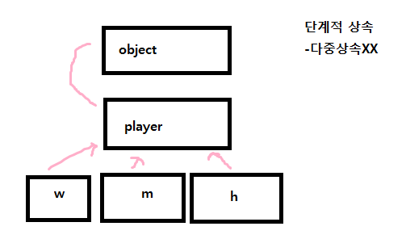

### 캡슐화

- 객체의 필드 메서드를 하나로 묶음   
- 실제 구현 내용 감춤(사용자의 편의정을 위해)   
- 객체 손상을 방지함

상속을 한다면 부모 먼저 생성 후 
추가한 값은 자식에만 저장

### 상속

- 바로 위에있는 부모한테만 접근 가능
- 상속이라는 뜻보다는 확장에 가까울수도

*다중상속의 문제점*
https://everyyy.tistory.com/entry/%EC%A3%BD%EC%9D%8C%EC%9D%98-%EB%8B%A4%EC%9D%B4%EC%95%84%EB%AA%AC%EB%93%9C-the-Deadly-Diamond-of-Death-%EB%8B%A4%EC%A4%91%EC%83%81%EC%86%8D%EA%B3%BC-%EA%B7%B8-%EC%9D%B4%EC%95%BC%EA%B8%B0     

자바에서는 허용이 안되지만 인터페이스에 있음

### protected
- 다른 패키지의 값을 상속받은 경우에는 사용가능하다
- 실무에서 사용多

---
### 자료구조와 알고리즘
#### 4강 - 투포인터 알고리즘
길이가 N인 배열에서 부분 배열 중 총합이 M인 경우의 수를 구하는 문제에서 활용   

*메모*
- 스프링 사용하기
