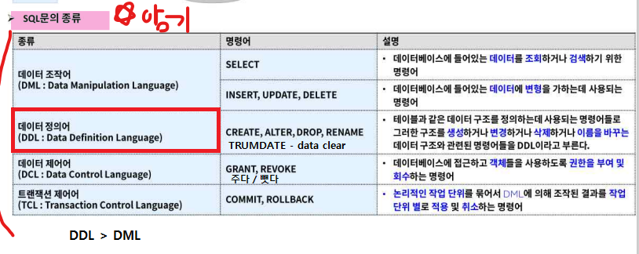
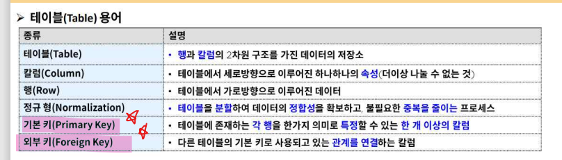

### database
*CRUD*  
create
read
update
delete

동시성제어   
ex. [이 자리는 선택된 좌석입니다]   

장애대응기능   

보안기능

### 3. 데이터베이스의 종류
- 관계형 데이터베이스
- NOSQL

## 2강 관계형데이터베이스

### 2-1.관계형데이터베이스란?
한 행이 하나의 데이터셋

**테이블**
like 2차원 배열

실전문제업로드X

1강~4강

<사원정보>

| 사번  | 이름  | 주소  | 부서번호 | 부서명 |
|-----|-----|-----|------|-----|
| 001 | 김   | 서울  | 001  | 영업부 |
| 002 | 김2  | 서울  | 001  | 영업부 |
| 003 | 김3  | 서울  | 002  | 개발부 |
| 004 | 김4  | 서울  | 001  | 영업부 |

- 영업부가 중복되는걸 막아서 정규화함
  - 부서명을 분리한 후 부서번호로 부서명을 찾아다님
  
 

- 배열 인덱스처럼 **기본키**로 데이터를 찾아다님(이메일, 아이디 등등)
