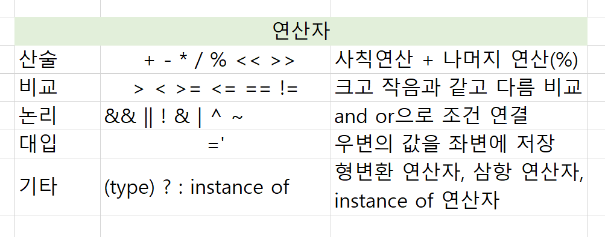

# 1. 기본데이터타입

### 1. 정수형
- 정수타입 - 4개의 크기가 다르다
> byte a = 127; // ~127까지 128 XXX   
short b = 32767; // ~32767까지    
int c = 2147483647; // ~2147483637까지   
// long d = 2147483648; // 왜 저장 안됨? -> 리터럴 공간이 int라서 저장XX, 접미사 L 사용   
long d = 2147483648L;

byte나 short 사용 거의 XX   
지금은 int를 주로 사용함!   
int는 대략 10자리 수까지 값을 저장할 수 있다.

### 2. 실수형
실수타입 - 리터럴은 double
> float f1 = 1.2345678901234F; //4byte - float 인척하려고 F로 리터럴 타입 바꿔줌   
double d1 = 1.2345678901234; //8byte
- 지수표기법으로 소숫정이하 구함   
  정밀도를 포기한 대신 표현범위를 넓힌 다음과 같은 방식으로 실수를 표현   
  -> 기본타입의 소숫점자리 연산에서 오차발생 가능성있음

### 3. 문자열
- 문자 타입 
  - 기본타입 : char   
    2byte 할당, 음수개념 X, 글자 1글자만 저장가능   
    ex) 아스키코드
  
             char c1 = 'A';
             char c2 = 65; //대문자 A
             char c3 = 98; // 소문자 a
             System.out.println("c2 = " + c2);

      - 문자열 타입 String - 기본X
        - String은 기본타입 아님 (char배열이 들어간)객체타입
        - 할당받는 수가 가변적이다.   
        ```
        String s1 = "hello java";
        ```
  String이 문자형의 기본 XX  
  char가 기본!   
  하지만 String을 대중적으로 많이 사용한다.

**[아스키코드]**   
아스키는 숫자 '0~9', 영문자'A~Z', 'a~z'가 연속적으로 배치되어 있음   
**[유니코드]**   
**2byte - 아스키코드 1byte에서 여러문자 담으면서 2byte로 증가**   
데이터들이 서로 형태를 바꾸는 것을 의미  
-> 묵시적 형변환과 명시적 형변환으로 나뉨

### 4. 논리형
- 논리타입 - t/f only 참고)c언어 t/f 존재X
```
boolean b1 = true;
boolean b2 = false;
```


## 2. 상수와 리터럴
- ### 상수
  - 한 번 저장한 값을 변경할 수 없다.  
  - 선언과 동시에 초기화
  - 상수의 이름은 대문자/캐멀테이스를 사용하는 것이 관례
  > final int MAX_SPEED = 10;
- ### 리터럴(literal)
  - 상수의 다른 이름
    - 연산 전에 순수하게 저장된 30과 40을 정수 리터럴이라고 부른다.   
    -> 물리적 값을 찾을 수 없음
    
*상수가 필요한 이유*   
리터럴에 의미있는 이름을 붙여 코드의 이해와 수정을 쉽게 만듦 


# 3. 형변환   
> 변수 또는 상수의 타입을 다른 타입으로 반환하는 것

## 3-1. 묵시적 형변환
작은 크기의 데이터 타입을 큰 데이터 타입으로 변환할 때는 자동으로 형 변환이 일어남

    byte < short = char < int < long < float < double

**왜 자동으로 해줄까?**   
-> 작은 단위에서 큰 단위로 이동하는 것은 여유 공간이 많아 문제 없다.

**왜 long이 float 앞에 있을까?**   
byte순이 아니라 그냥 rule   
실수는 정수보다 표현범위 big -> 그래서 float가 앞

## 3-2. 명시적 형변환
downCasting : 하위타입 변환   
<br/>
다운캐스팅 시 값의 손실이 일어날 수 있음

    byte < short = char < int < long < float < double <-

큰 크기의 데이터 타입을 작은 데이터 타입으로 변환할 때는
형 변환 연산자를 사용해서 직접 변환을 명시

            int n = 1000;
            byte m = (byte) n; //형변환에 동의표시

()안에 바꿀 데이터타입을 넣어서 동의표시하기

### 실수를 정수로 강제변환시 소숫점이 사라짐
-> 일부러 그럴수 있음

## 4. 연산자


### 1. 산술연산자
- 사칙연산자( +, - , * , / )
- 나머지 연산자 ( % )

### 2. 비교연산자
- 대소비교 연산자 < > <= >=
- 등가비교 연산자 == !=
- 문자열의 비교 equals()

### 3. 논리 연산자
- 논리 연산자 && || !
  - '||' 피연산자 중 어느 한 쪽만 true이면 true를 결과로 얻는다
  - '&&' 피연산자 양쪽모두 true여만 true를 결과로 얻는다.

### 4. 비트연산자
- 비트연산자 & | ^ ~ << >>
- 피연산자를 비트단위로 논리연산한다.

### 5. 그 외 연산자
- 조건 연산자 ? :
- 대입연산자 =

---

**두꺼운 커서 뜰떄**
insert 눌러보기
안되면 종료후 다시시작
