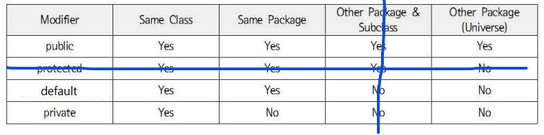
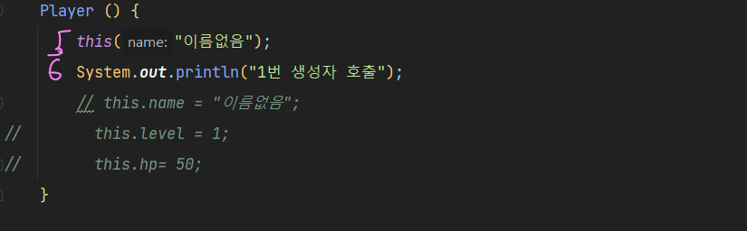
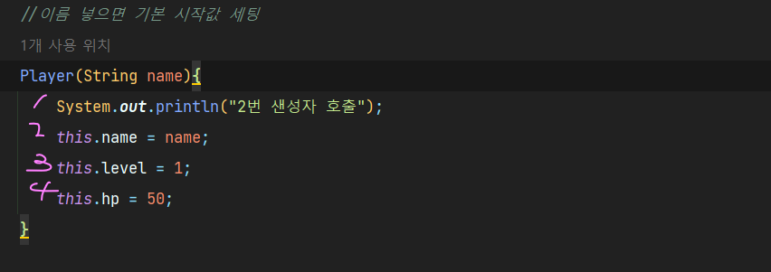

## 패키지
- 클래스를 분별하기 위해서 패키지로 구분함 like 폴더

>package 상위패키지.하위패키지;  

- 소문자로 작성하는게 관례
- 숫자로 시작 불가, 특수문자 사용 불가($, _ 제외)
- ~~최상위 패키지는 java로 시작할 수 있다~~
-> 가능하지만 하지 말자

## import
- 다른 패키지에 속한 클래스를 사용하는법
> 1. import app.myuser.User(class명);
> 2. import app.myuser.*;  

다른 특정패키지의 클래스를 여러개 사용한다면 '*' 사용하기  

## 접근제한자

[캡쳐 이미지 들어감]
오옹 이거 머야?? - 오늘의 발견   
/ 사이즈는 크기에따라 알아서 조절됨

> public > protected > default > private

1. 접근제한자 설정X시 default로 기본 설정
2. 클래스에는 public과 default만 사용가능
3. 필드, 메서드, 생성자에는 4가지 제한자를 모두 사용가능

## 실행순거

+ public
# protected
~ default
- private