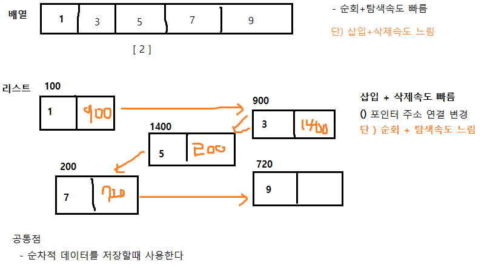

## 자료구조와 알고리즘

- 빅 오메가: 최선일 때 (best case)의 연산 횟수를 나타낸 표기법
- 빅 세타: 보통일 때 (average case)의 연산 횟수를 나타낸 표기법
- 빅 오: 최악일 때 (worst case)의 연산 횟수를 나타낸 표기법

*알고리즘에서는 빅-오 표기법을 기준으로 코드를 작성*  
->최악의 상황을 염두에 두고 알고리즘을 한다!!

* 빅-오 표기법의 특징
1. 상수항 무시: 빅-오표기법은 데이터 입력값(N)이 충분히 크다고 가정
   하고 있고, 알고리즘의 효율성 또한 N의 크기에 따라 영향을 받기 때문에
   상수항같은 사소한 부분은 무시한다.
   Ex) O(3N) -> O(N)
2. 영향력 없는 항 무시 : 가장 영향력이 큰 항을 제외하고는 모두 무시한다.
   Ex) O(3N^2 + 2N + 1) -> O(N^2)

시간 제한이 1초라면 일반적으로 1억번 연산 안에 문제를 해결해야함
정렬 알고리즘
버블 정렬은 O(N^2)의 시간복잡도를 가지며 
병합 정렬은 O(nlogn)의 시간복잡도를 가집니다.

## 배열과 리스트

### 배열
배열은 메모리의 연속 공간에 값이 채워져 있는 형태의 자료구조   
> [1][2][3][4][5]

*특징*
 - 인덱스를 사용하여 특정 값에 바로 접근할 수 있다.
-> 시간복잡도 1개 탐색이 가능?
 - 새로운 값을 넣거나 삭제하는 과정이 비효율적이다.

### 리스트
값과 포인터를 묶은 노드라는 것을 *포인터(주소)로 연결*한 자료구조

연결리스트
일정한 순서를 가지는 자료 요소들을 표현하는 방법
